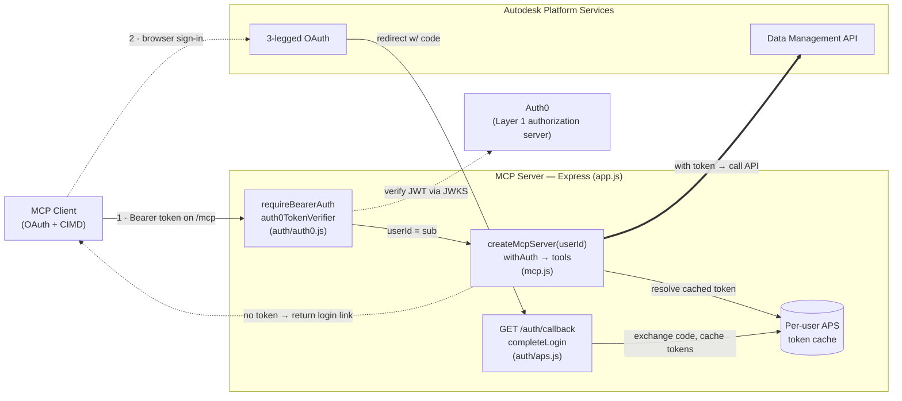
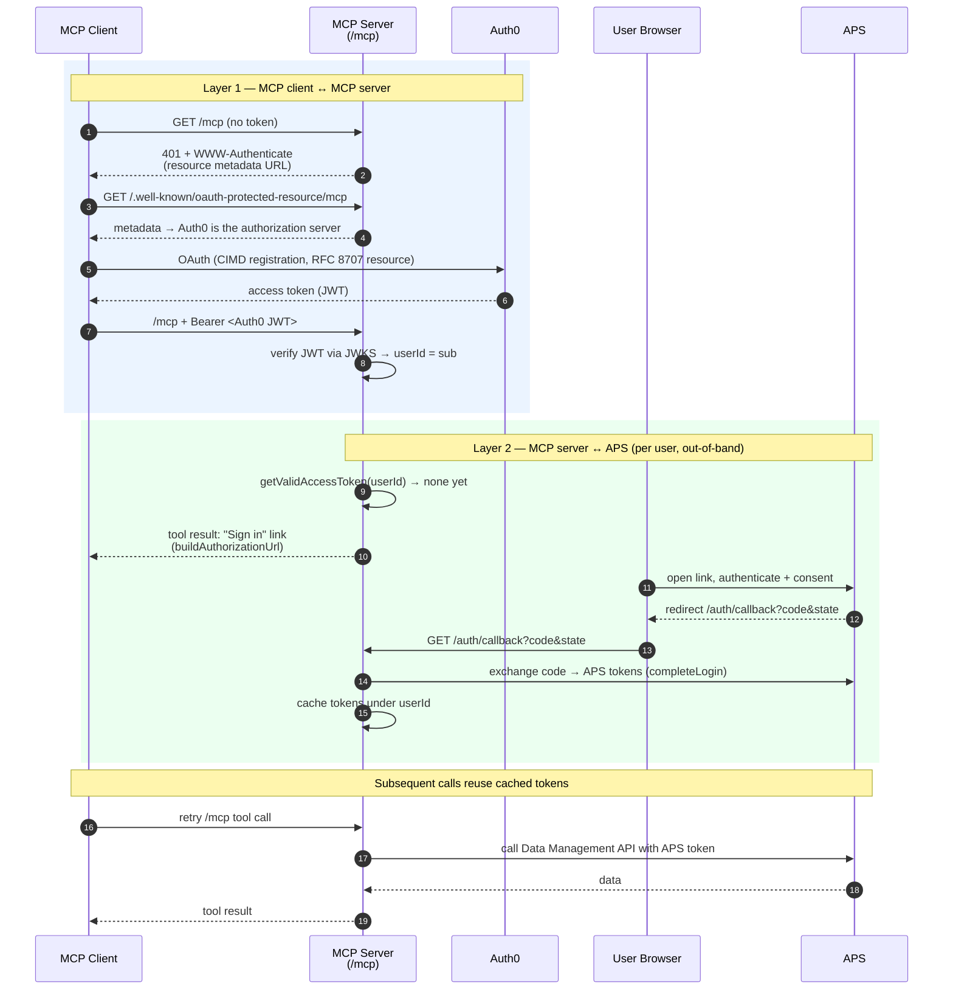

# APS MCP Auth0 Example

Example MCP server for Autodesk Platform Services demonstrating proper auth implementation.

https://github.com/user-attachments/assets/496794cb-7e3d-496f-8b5e-8604ae866e7a

> **Auth0 is just one option here.** This example uses [Auth0](https://auth0.com/) as the Layer 1 authorization server, but nothing about the MCP server is tied to it — the server only *verifies* bearer tokens against a standard OAuth/JWKS endpoint. You can swap in any OAuth 2.0 authorization server that fits your needs, such as [WorkOS](https://workos.com/), [Okta](https://www.okta.com/), [Microsoft Entra ID](https://www.microsoft.com/security/business/identity-access/microsoft-entra-id), [Keycloak](https://www.keycloak.org/), or your own. If you do, adapt `auth/auth0.js` (token verification and metadata discovery) and the corresponding config accordingly; the Layer 2 APS flow stays the same.

## Features

Two-layer authentication, targeting the [2026-07-28 MCP specification release candidate](https://blog.modelcontextprotocol.io/posts/2026-07-28-release-candidate/):

- **Layer 1** (MCP client -> MCP server): every `/mcp` request must carry an `Authorization: Bearer` token issued by [Auth0](https://auth0.com/), which acts as the OAuth authorization server for this MCP server. Clients register via a [Client ID Metadata Document (CIMD)](https://auth0.com/blog/cimd-vs-dcr-mcp-registration/) instead of Dynamic Client Registration — see [Setting up Auth0](#setting-up-auth0-layer-1) below.
- **Layer 2** (MCP server -> APS): standard APS 3-legged OAuth, run out-of-band in the user's browser. The MCP client's own token is never forwarded to APS (no token passthrough).
- The server is fully stateless — a fresh MCP server instance is built per request (no `Mcp-Session-Id`), from just the validated Layer-1 subject. Each tool then tries to resolve that user's cached APS token itself.
- When a tool needs the user to sign in, it returns a plain-text login link in the tool result. (URL elicitation, so clients can prompt the user directly, may be reintroduced later.)

## What's inside

- `app.js`: Express app wiring Layer 1 (Auth0 bearer auth + OAuth protected-resource metadata) in front of the stateless MCP handler from `mcp.js`
- `mcp.js`: Defines the MCP tools for APS projects and builds the per-request MCP server — a fresh server is built per request from just the caller's user ID. A shared `withAuth` helper wraps every tool handler: it resolves the caller's APS access token (or returns a login prompt if they haven't signed in yet) before the handler runs, which then calls `@aps_sdk/*` clients directly with that token
- `auth/auth0.js`: Layer 1 — verifies Auth0-issued access tokens (`OAuthTokenVerifier`) and fetches Auth0's OAuth metadata
- `auth/aps.js`: Layer 2 — APS 3-legged OAuth via `@aps_sdk/authentication` (authorization URL, code exchange, token refresh, per-user token cache)

> This example targets `@modelcontextprotocol/server`/`@modelcontextprotocol/node` **2.0.0-beta**, which implement the still-unreleased 2026-07-28 spec revision. `@modelcontextprotocol/express` supplies the Express-specific OAuth resource-server helpers (`requireBearerAuth`, `mcpAuthMetadataRouter`) for that same beta line — APIs may still change before the spec and packages are finalized.

## Architecture

Two independent OAuth relationships meet at the MCP server. **Layer 1** guards the `/mcp` endpoint itself (MCP client ↔ MCP server, via Auth0). **Layer 2** lets the server call APS on the user's behalf (MCP server ↔ APS, standard 3-legged OAuth). The two never mix: the client's Auth0 token is only ever used to identify the caller, and is **never** forwarded to APS.

### Authentication flow

The full round trip the first time a user connects and asks a question — the two layers are numbered to match the diagram above.

## Setting up Auth0 (Layer 1)

This protects `/mcp` itself — separate from, and in addition to, the APS sign-in below.

1. In your Auth0 tenant, create an **API** (Applications > APIs > Create API) representing this MCP server. Use the server's public `/mcp` URL — `https://<PUBLIC_HOST>/mcp` (e.g. `https://your-server.example.com/mcp`) — as the **Identifier**. The server derives its Auth0 audience from `PUBLIC_HOST`, so the Identifier must match exactly.
2. Enable Client ID Metadata Documents so MCP clients (which host their own CIMD instead of registering an app in your tenant) can connect: go to **Settings > Advanced**, and toggle on **Client ID Metadata Document Registration**.
3. For MCP-specific resource-parameter handling (RFC 8707), also enable the **Resource Parameter Compatibility Profile** in the same **Settings > Advanced** section.
4. Grant the MCP client(s) you intend to use access to the API you created in step 1 (**Applications > APIs > *your API* > Application Access**, or authorize the scopes by default for third-party applications in the API's settings).
5. Set `AUTH0_DOMAIN` (your tenant domain, e.g. `your-tenant.us.auth0.com`) in `.env`. The audience is computed from `PUBLIC_HOST` and does not need to be set separately.

With this in place, MCP clients that support CIMD (per [SEP-991](https://workos.com/blog/client-id-metadata-documents-cimd-oauth-client-registration-mcp)) can discover Auth0 via this server's `/.well-known/oauth-protected-resource/mcp` and authenticate without any manual app registration in your tenant.

## Setting up APS 3-legged OAuth (Layer 2)

1. Reuse or create an APS app (**Traditional Web App** type) at https://aps.autodesk.com/myapps.
2. Add the callback URL `https://<PUBLIC_HOST>/auth/callback` (the server derives it from `PUBLIC_HOST`) to the app's allowed callback URLs.
3. Set `APS_CLIENT_ID`, `APS_CLIENT_SECRET`, and `PUBLIC_HOST` in `.env`.

The per-user APS token cache in `auth/aps.js` (and the `state` -> user correlation map used during login) are kept in memory for this example — swap them for Redis (or similar) in production.

## Deploy

> This server **cannot be run locally.** Everything (the `/mcp` URL, the APS callback, and the Auth0 audience) is derived from a single `PUBLIC_HOST`, and that host must be publicly reachable over HTTPS and registered as the API Identifier ("audience") in Auth0 — see [Setting up Auth0](#setting-up-auth0-layer-1). Deploy it to a public host; there is no `localhost` fallback.

1. Install dependencies:
   `npm install`
2. Create a `.env` in the repo root (see `.env` for the full list):
   - `APS_CLIENT_ID`, `APS_CLIENT_SECRET` (see [Setting up APS 3-legged OAuth](#setting-up-aps-3-legged-oauth-layer-2))
   - `AUTH0_DOMAIN` (see [Setting up Auth0](#setting-up-auth0-layer-1))
   - `PUBLIC_HOST` — the server's public host (e.g. `your-server.example.com`, no scheme). The server derives all of the following from it:
     - the public `/mcp` URL and Auth0 audience: `https://<PUBLIC_HOST>/mcp`
     - the APS callback URL: `https://<PUBLIC_HOST>/auth/callback`
     - the host allowlist
   - Optional: `PORT` (default `3000`)
3. Start the server:
   `npm start`

Connect an MCP client that supports OAuth (and ideally CIMD + the 2026-07-28 revision) to `https://<PUBLIC_HOST>/mcp`, and start asking questions such as:

- _What projects do I have access to?_
- _What issues are open in that project?_

The first request will prompt you to sign in with your Autodesk account (Layer 2); once that completes, retry the same request.
